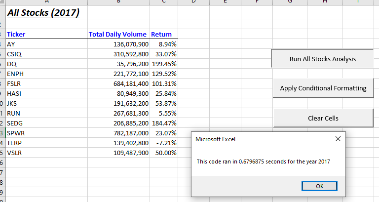
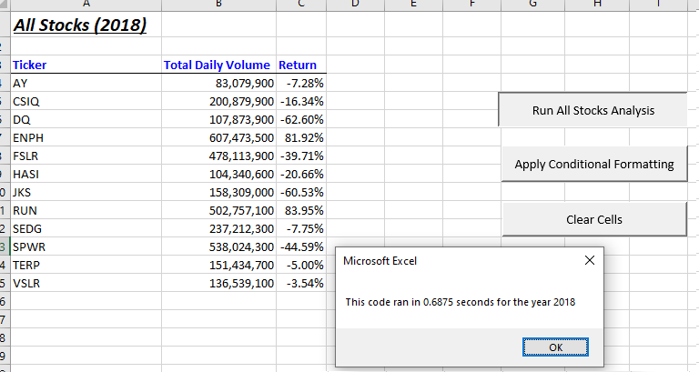
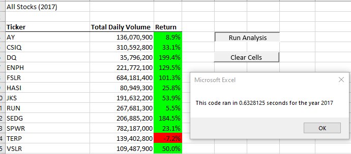

# VBA Stock Analysis Script Refactoring
## Project Overview: 
The project presents the results of refactored script of the original VBA stock analysis of the 2017 and 2018 stock market. Although the original script delivered the required results, this project refactors with the aim to improve the performance of the script and make it applicable for future analyses of the stock market.
## Results:
The original script performed the analyses of 2017 and 2018 stock market data sets in 0.6796875 and 0.6875 seconds respectively. The following evidence demonstrates approximately under 7% improvement in the performance measures between the original and refactored scripts:
### Original script performance measure for the 2017 dataset
 
### Original script performance measure for the 2018 dataset

### Refactored script performance measure for the 2017 dataset

### Refactored script performance for the 2018 dataset
 

The near 7% improvement in performance was achieved by creating output arrays to store the values for the volume, starting price, and ending price of each stock ticker in addition to the tickers array of the original script in the following manner:
‘Dim tickerVolumes(12) As Long’
‘Dim tickerStartingPrices(12) As Single’
‘Dim tickerEndingPrices(12) As Single’
A ‘tickerIndex’ variable was used to access the correct index across the four arrays. Such refactoring resulted in the improved performance of the ‘for’ loop that runs through all the rows to identify, store, and calculate values that match the ticker. 

## Summary:
The following conclusions may be drawn from the evidence above:
1.	Refactoring has the advantages of improved performance, better clarity and style, reproducibility of code by other users, detailed revision, a more consistent coding pattern. Another point of advantage of refactoring may be that the code can be made more applicable for future use and expansion. It also showed to be useful for improving coding skills and overall understanding of programming. Arguably, refactoring can also be disadvantageous for times-sensitive projects as it requires significantly more time. Refactoring can also introduce idiosyncratic solutions to problems, which may require additional information from the original coder. 
2.	In light of the original VBA script, the advantages and disadvantages listed above are demonstrable in the performance measures and in the amount of questions and research it required. When compared, the refactored code is easier to read and understand. It uses computer resources more efficiently, as is demonstrated by the improved performance. However, presently, the rationale behind ‘tickerIndex’ remains unclear. 

